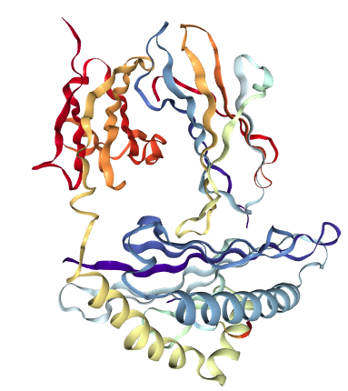
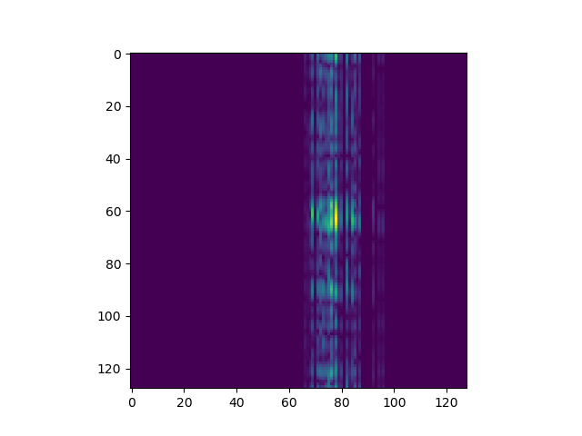

# Welcome to temVisorLayers

## What's temVisorLayers?

tem Visor Layers is a python3-application that let you see the phase pattern of a cif file.

C U B I C
U \     U \
B   C U B I C
I   U   I   U
C U B I C   B
  \ I     \ I
    C U B I C

The example file can be found in:

[3PAB](https://www.rcsb.org/structure/3PAB)

the image of this protein is the next one:



For running once installed python3,numpy and matplotlib, (detailed in troubleshooting.md).
open a terminal and write:

```bash
python3 temVisorLayers.py <cifFile> scatteringTables10.csv <voltage applied in Volts>
```

example:

```bash
$python3 temVisorLayers.py 3pab.cif scatteringTables10.csv 80000
```



You can contact me:

## License

temVisorLayers is released under the [MIT License](https://opensource.org/licenses/MIT).

### Author

* **Luis Roberto Azaar Meza** (CFATA, UNAM)

### Reference

Azaar Meza, Luis Roberto. (2015). "Simulación de estructuras cristalinas y de formación de patrones de difracción de electrones". (Master degree Thesis). Universidad Nacional Autónoma de México, México. https://repositorio.unam.mx/contenidos/65327

  ### Contact

  ```bash
  Luis Roberto Azaar Meza
  e-mail 1: luisro5@hotmail.com
  e-mail 2: rigel1357@yahoo.com
  ```
